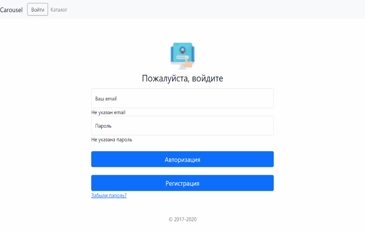
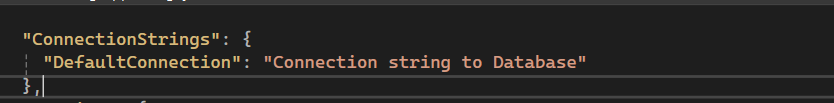

# Интернет-магазин
<!-- Gif-демо -->

*Интернет-магазин* — это сайт, который позволяет пользователям совершать покупки через интернет. Вы можете выбрать товары, сформировать заказ, оплатить его и выбрать способ доставки, все онлайн.

### Содержание
- [Назначение](#why)
- [Установка](#install)
- [Применение](#apply)
- [Лицензия](#license)

#### Назначение:

Интернет-мазагин выполняет следующие функции:
-	ведение панели администратора;
-	авторизация, аутентификация, верификация пользователя;
-	поиск, сортировка и фильтрация данных;
-	обновление учетных данных, восстановление пароля;
-	добавление товаров в корзину, оформление заказа;
-	просмотр заказов и вывод на печать.

#### Установка:

Веб-сайт должен быть развёрнут в сети Интернет.
Требования к  программному обеспечению:
1. пакет Microsoft NET-SDK 8.0;
2. веб-сервер Nginx (Apache, IIS);
3. СУБД «MySQL» 6.0 и выше.
   
Для корректной работы необходимо указать корректную строку подключения для работы с базой данных MySql `ShopComp/appsettings.json`.

Технологии и компоненты: Asp.Net Core, Entity Framework Core, C#, Bootstrap, HTML5, CSS3, JavaScript, MailKit

#### Применение:

Внедрение проекта позволило:
- обеспечение отказоустойчивости работы путём использования валидации;
- обеспечить продажу товаров круглосуточно без наличия графических ограничений;
- обеспечить логгирование выполненных заданий по каждому пользователю;
- упростить обучение и освоение новым сотрудникам. 

#### Лицензия:

> GitHub [@TheLidren](https://github.com/TheLidren)
LinkedIn [@Vladislav Misevich](https://by.linkedin.com/in/thelidren/ru)

